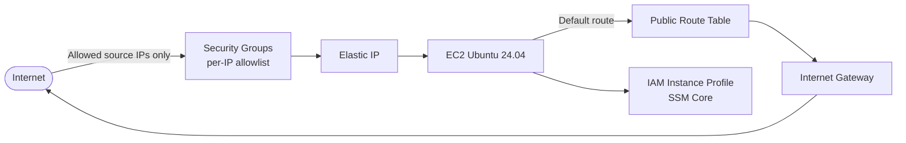

# Resilmesh v2 – Terraform (AWS)

Terraform codebase to provision a **minimal, security-conscious AWS footprint** for the **Resilmesh v2** environment.  
It deploys networking, IAM, and a single EC2 instance ready to run containers (Docker + Compose) and bootstrap an application stack via a Git clone.

---

## What this deploys

### Networking (`modules/network`)
- **VPC** with DNS support/hostnames enabled
- **Internet Gateway**
- **Public subnet** (first CIDR from `public_subnets`) in the first available AZ
- **Public route table** + default route to the IGW
- **Security Groups restricted by source IP**:
  - One security group per IP in `my_ips`
  - Ingress opens a curated set of TCP ports (SSH, HTTP/HTTPS, and service ports) **only** to the allowed IPs
  - Egress open to `0.0.0.0/0`

### IAM (`modules/iam`)
- EC2 IAM Role + Instance Profile
- Attaches **AmazonSSMManagedInstanceCore** (enables AWS Systems Manager access)

### Compute (`modules/ec2`)
- **Ubuntu 24.04 (Noble) AMI** (most recent) from Canonical owners
- **Single EC2 instance** (in the public subnet) with:
  - EBS optimized + detailed monitoring enabled
  - **Encrypted root volume** (gp3) sized to **1000 GiB** (see cost note below)
  - **Elastic IP** attached to the instance
- `user_data` bootstrap:
  - Disables SSH password authentication and root login
  - Installs Docker Engine + Docker Compose v2 plugin
  - Adds the provided client public SSH keys to `ubuntu`’s `authorized_keys`
  - Clones `resilmesh2/Docker-Compose`

---

## Architecture (conceptual)



---

## Repository structure

```text
.
├── main.tf
├── providers.tf
├── data_sources.tf
├── outputs.tf
├── vars.tf
├── envs/
│   └── pilot2.tfvars.example
└── modules/
    ├── network/
    │   ├── main.tf
    │   ├── vars.tf
    │   └── outputs.tf
    ├── iam/
    │   ├── main.tf
    │   ├── vars.tf
    │   └── outputs.tf
    └── ec2/
        ├── main.tf
        ├── vars.tf
        ├── outputs.tf
        └── user_data.sh
```

---

## Prerequisites

- **Terraform >= 1.6**
- AWS credentials configured locally (e.g., via `aws configure --profile <profile>`)
- An AWS account with permissions to create:
  - VPC/Subnet/Route Tables/IGW/Security Groups
  - IAM Roles + Instance Profiles
  - EC2 instances + EIP

---

## Configuration

### SSH Key Pair

This deployment disables password authentication for security. You must provide an **SSH Public Key** to access the server. The module is optimized for `ed25519` keys.

1.  **Check for existing keys:**
    ```bash
    cat ~/.ssh/id_ed25519.pub
    ```
2.  **Generate a new pair (if needed):**
    ```bash
    ssh-keygen -t ed25519 -C "your_email@example.com"
    ```
3.  **Copy the key:** Copy the entire content of the `.pub` file. You will add this string to the `client_public_ssh_keys` list in your `tfvars` file them.

### AWS CLI

Terraform interacts with AWS using your local credentials. You must have the AWS CLI installed and configured.

1.  **Install AWS CLI:**
    Follow the [official AWS documentation](https://docs.aws.amazon.com/cli/latest/userguide/getting-started-install.html) for your operating system.

2.  **Configure the Profile:**
    The example configuration uses a named profile (`Resilmesh`). Configure it by running:
    ```bash
    aws configure --profile Resilmesh
    ```

3.  **Enter Credentials:**
    When prompted, provide your **Access Key ID**, **Secret Access Key**, and the target **Region** (e.g., `eu-south-2`).

This repo uses a **tfvars** file to keep environment-specific inputs together.

### Example: `envs/pilot2.tfvars.example` (template)

> **Important:** do not commit real keys to git. Therefore, copy this file to the same path and name it `pilot2.tfvars`

```hcl
region  = "eu-west-1"
profile = "Resilmesh"

# Public keys allowed to SSH into the instance as ubuntu
client_public_ssh_keys = [
  "ssh-ed25519 AAAA... user1",
  "ssh-ed25519 AAAA... user2",
]

# Source IPs allowed to access exposed service ports (CIDR /32 recommended)
my_ips = [
  "203.0.113.10/32",
  "203.0.113.11/32",
]
```

### Why `envs/pilot2.tfvars` matters

Keeping configuration in `envs/pilot2.tfvars` helps you:
- **Separate code from configuration** (same Terraform code can deploy different environments)
- **Reproducibly control access** via `my_ips` (tight allowlist rather than open inbound)
- **Rotate credentials easily** (e.g., SSH keys without touching module code)
- **Switch AWS target context** with `region` + `profile` (avoids accidental deployments to the wrong account/region)

---

## Deploy
> The following commands should be run from the root directory of the repository, using a terminal.

### Initialize

```bash
terraform init
```

### Plan

**PowerShell (Windows):**
```powershell
terraform plan -var-file ".\envs\pilot2.tfvars"
```

**Bash (Linux/macOS):**
```bash
terraform plan -var-file "./envs/pilot2.tfvars"
```

### Apply

**PowerShell (Windows):**
```powershell
terraform apply -var-file ".\envs\pilot2.tfvars"
```

**Bash (Linux/macOS):**
```bash
terraform apply -var-file "./envs/pilot2.tfvars"
```

---

## Outputs

After `apply`, Terraform returns:

- `instance_id`
- `public_ip` (Elastic IP)
- `private_ip`

---

## Destroy (cleanup)

> This will remove the infrastructure created by this repo, including the EC2 instance, EIP, and network components.

**PowerShell (Windows):**
```powershell
terraform destroy -var-file ".\envs\pilot2.tfvars"
```

**Bash (Linux/macOS):**
```bash
terraform destroy -var-file "./envs/pilot2.tfvars"
```

---

## Troubleshooting

- **“No valid credential sources found” / wrong account**
  - Ensure `profile` in your tfvars matches a configured AWS CLI profile.
- **Cannot reach the instance**
  - Verify your public IP is present in `my_ips` (use `/32`).
  - Check that you are connecting to the **Elastic IP** from the Terraform output.
- **Git clone fails in user_data**
  - Review cloud-init logs: `/var/log/cloud-init-output.log`.
- **Error when trying to enter via ssh**
  - If you rebuilt the instance but did not do so with the EIP (the public IP remains the same), you will likely see a **Warning** window. In that case, use this command and then try logging in again:
  ```bash
    ssh-keygen -R <Public IP>
  ```