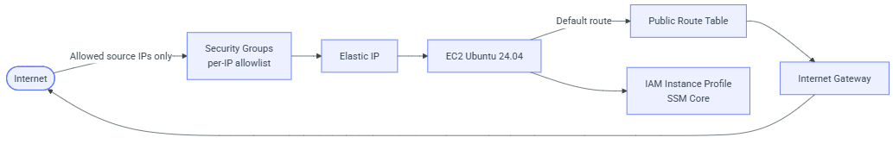
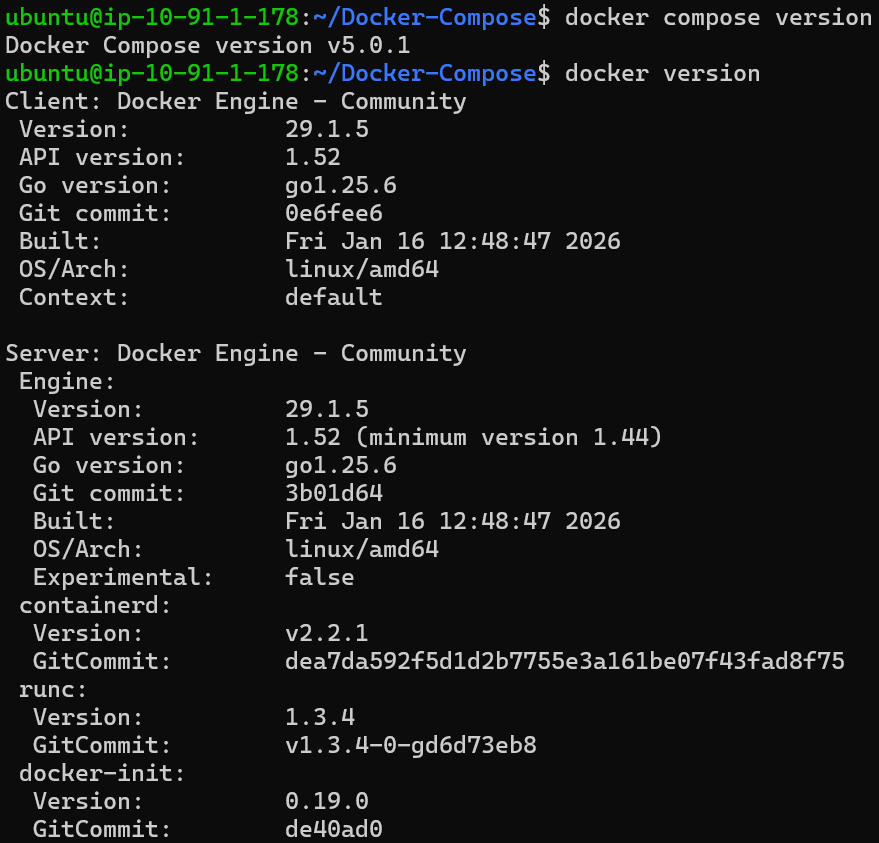
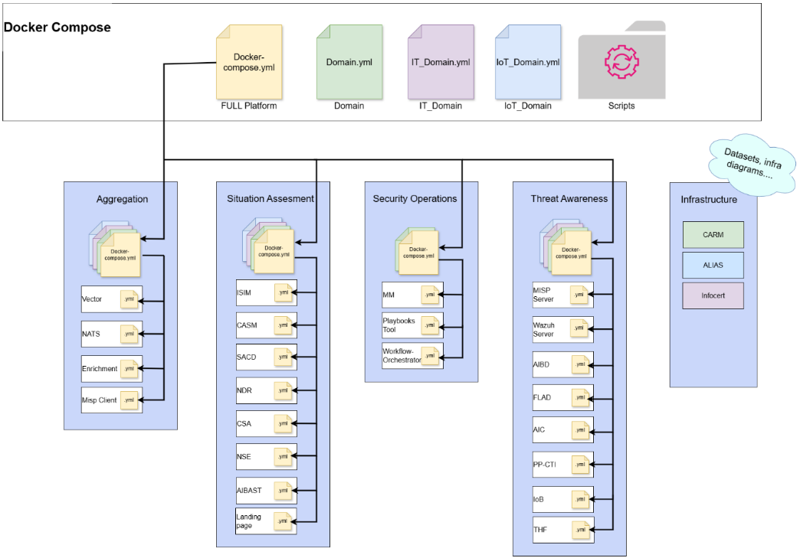
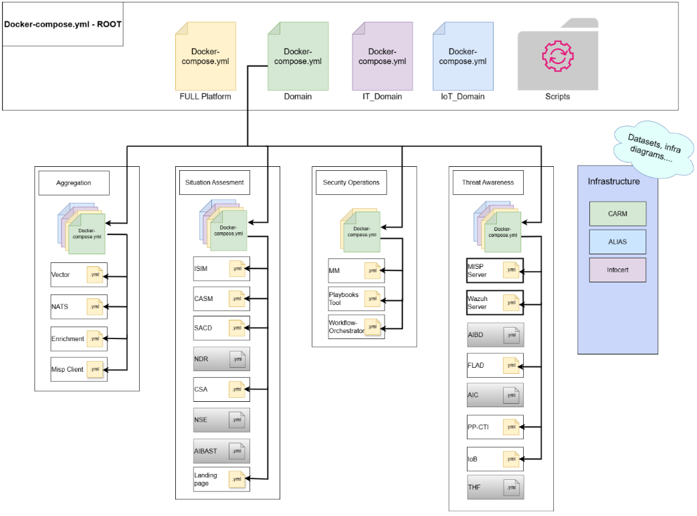
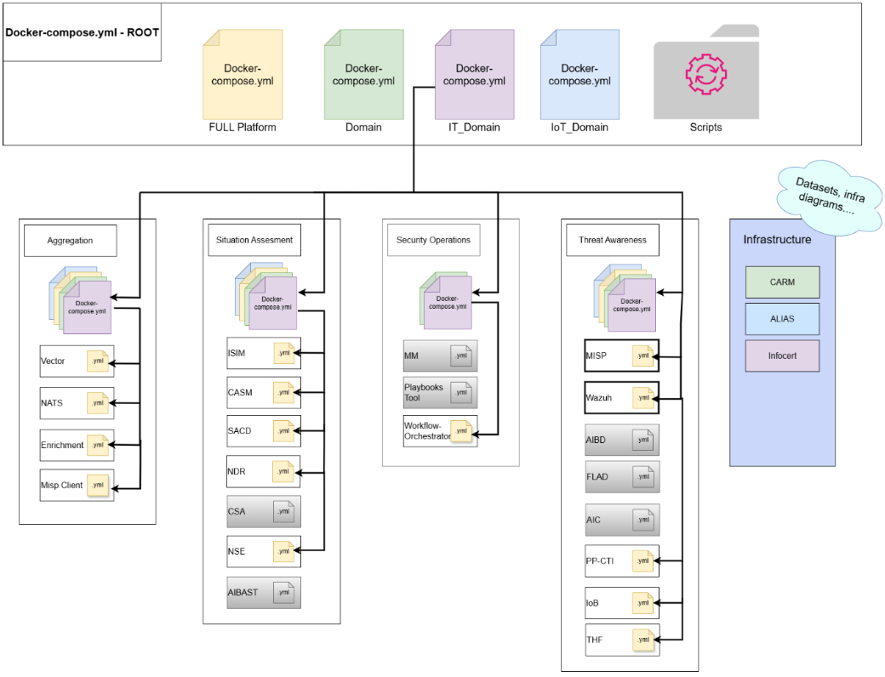
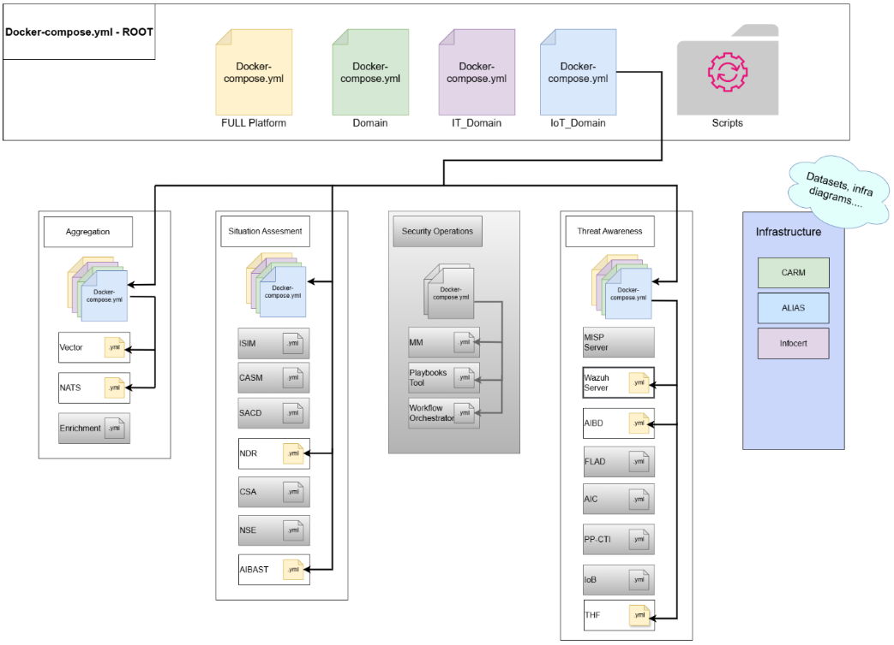

# Resilmesh v2 - Deployment Guide

This documentation covers two deployment options for the **Resilmesh v2** environment:

1. **AWS Deployment (Terraform)** – Automated cloud infrastructure
2. **Local Deployment (On-Premise)** – Physical server or local VM

Both options converge on the same Docker Compose-based application stack.

---

## AWS Deployment (Terraform)

Terraform codebase to provision a **minimal, security-conscious AWS footprint** for the **Resilmesh v2** environment.  
It deploys networking, IAM, and a single EC2 instance ready to run containers (Docker + Compose) and bootstrap an application stack via a Git clone.  
[GitHub repository](https://github.com/resilmesh2/AWSCloud-Deployment)  

### What Terraform Deploys

#### Networking

**Module:** `modules/network`

* **VPC** with DNS support/hostnames enabled
* **Internet Gateway**
* **Public subnet** (first CIDR from `public_subnets`) in the first available AZ
* **Public route table** + default route to the IGW
* **Security Groups restricted by source IP**:
    * One security group per IP in `my_ips`
    * Ingress opens a curated set of TCP ports (SSH, HTTP/HTTPS, and service ports) **only** to the allowed IPs
    * Egress open to `0.0.0.0/0`

#### IAM

**Module:** `modules/iam`

- EC2 IAM Role + Instance Profile
- Attaches **AmazonSSMManagedInstanceCore** (enables AWS Systems Manager access)

#### Compute

**Module:** `modules/ec2`

* **Ubuntu 24.04 (Noble) AMI** (most recent) from Canonical owners
* **Amazon EC2** `m5.4xlarge` instance:
    * vCPUs: 16
    * Memory: 64 GiB of RAM
    * Storage: Optimised for EBS (Elastic Block Store) only
    * Network Performance: Up to 10 Gbps
    * Cost Considerations: 0.856 U$D per hour in Ireland region
    This price may vary, to check the price at the time of launch, please use the [Official Amazon Website](https://aws.amazon.com/es/ec2/pricing/on-demand/)
* **Single EC2 instance** (in the public subnet) with:
    * EBS optimized + detailed monitoring enabled
    * **Encrypted root volume** (gp3) sized to **1000 GiB**
    * **Elastic IP** attached to the instance
* **user_data.sh** bootstrap:
    * Disables SSH password authentication and root login
    * Installs Docker Engine + Docker Compose v2 plugin
    * Adds the provided client public SSH keys to `ubuntu/.ssh/authorized_keys`
    * Clone [resilmesh2/Docker-Compose](https://github.com/resilmesh2/Docker-Compose/)

### Architecture

<p align="center">
  
</p>

### Repository Structure

```text
.
├── main.tf
├── providers.tf
├── data_sources.tf
├── outputs.tf
├── vars.tf
├── envs/
│   └── pilot2.tfvars.example
└── modules/
    ├── network/
    │   ├── main.tf
    │   ├── vars.tf
    │   └── outputs.tf
    ├── iam/
    │   ├── main.tf
    │   ├── vars.tf
    │   └── outputs.tf
    └── ec2/
        ├── main.tf
        ├── vars.tf
        ├── outputs.tf
        └── user_data.sh
```

### Prerequisites

* **Terraform >= 1.6**
* AWS credentials configured locally (e.g., via `aws configure --profile <profile>`)
* An AWS account with permissions to create:
    * VPC/Subnet/Route Tables/IGW/Security Groups
    * IAM Roles + Instance Profiles
    * EC2 instances + EIP

### Configuration

#### SSH Key Pair

This deployment disables password authentication for security. You must provide an **SSH Public Key** to access the server. The module is optimized for `ed25519` keys.

1. **Check for existing keys:**
```bash
cat ~/.ssh/id_ed25519.pub
```
2. **Generate a new pair (if needed):**
```bash
ssh-keygen -t ed25519 -C "your_email@example.com"
```
3. **Copy the key:** Copy the entire content of the `.pub` file. You will add this string to the `client_public_ssh_keys` list in your `tfvars` file.

#### AWS CLI

Terraform interacts with AWS using your local credentials. You must have the AWS CLI installed and configured.

1. **Install AWS CLI:**
Follow the [official AWS documentation](https://docs.aws.amazon.com/cli/latest/userguide/getting-started-install.html) for your operating system.

2. **Configure the Profile:**
The example configuration uses a named profile (`Resilmesh`). Configure it by running:
```bash
aws configure --profile Resilmesh
```

3. **Enter Credentials:**
   When prompted, provide your **Access Key ID**, **Secret Access Key**, and the target **Region** (e.g., `eu-west-1`).

#### Configuration File

This repo uses a **tfvars** file to keep environment-specific inputs together.

##### Example: `envs/pilot2.tfvars.example`

**Important:** do not commit real keys to git. Therefore, copy this file to the same path and name it `pilot2.tfvars`

```hcl
region  = "eu-west-1"
profile = "Resilmesh"
instance_type = "m5.4xlarge"

# Public keys allowed to SSH into the instance as ubuntu
client_public_ssh_keys = [
  "ssh-ed25519 AAAA... user1",
  "ssh-ed25519 AAAA... user2",
]

# Source IPs allowed to access exposed service ports (CIDR /32 recommended)
my_ips = [
  "203.0.113.10/32",
  "203.0.113.11/32",
]
```
We use the EC2 instance type shown here to perform all tests.

##### Why `envs/pilot2.tfvars` matters

Keeping configuration in `envs/pilot2.tfvars` helps you:

* **Separate code from configuration** (same Terraform code can deploy different environments)
* **Reproducibly control access** via `my_ips` (tight allowlist rather than open inbound)
* **Rotate credentials easily** (e.g., change SSH keys without touching module code)
* **Switch AWS target context** with `region` + `profile` (avoids accidental deployments to the wrong account/region)

### Deployment Steps

The following commands should be run from the root directory of the repository, using a terminal.

#### Initialize

```bash
terraform init
```

#### Plan

**PowerShell (Windows):**
```powershell
terraform plan -var-file ".\envs\pilot2.tfvars"
```

**Bash (Linux/macOS):**
```bash
terraform plan -var-file "./envs/pilot2.tfvars"
```

#### Apply

**PowerShell (Windows):**
```powershell
terraform apply -var-file ".\envs\pilot2.tfvars"
```

**Bash (Linux/macOS):**
```bash
terraform apply -var-file "./envs/pilot2.tfvars"
```

### Outputs

After `apply`, Terraform returns:

- `instance_id`
- `public_ip` (Elastic IP)
- `private_ip`

### Cleanup

This will remove the infrastructure created by this repo, including the EC2 instance, EIP, and network components.

**PowerShell (Windows):**
```powershell
terraform destroy -var-file ".\envs\pilot2.tfvars"
```

**Bash (Linux/macOS):**
```bash
terraform destroy -var-file "./envs/pilot2.tfvars"
```

### Troubleshooting

#### No valid credential sources found

Ensure `profile` in your tfvars matches a configured AWS CLI profile.

#### Cannot reach the instance

- Verify your public IP is present in `my_ips` (use `/32`)
- Check that you are connecting to the **Elastic IP** from the Terraform output

#### Git clone fails in user_data

- Review cloud-init logs: `/var/log/cloud-init-output.log`

#### Error when trying to enter via ssh

If you rebuilt the instance but did not do so with the EIP (the public IP remains the same), you will likely see a **Warning** window. In that case, use this command and then try logging in again:
```bash
ssh-keygen -R <Public IP>
```

---

## Local Deployment (On-Premise)


This option allows you to deploy Resilmesh on a physical server or local virtual machine running Ubuntu.

### Prerequisites

* **Server**: A server (physical or virtual) with at least **16 CPUs/vCPUs** and **64 GiB of RAM memory**.
* **Operating System**: **Ubuntu 20.04 or higher** (Ubuntu 24.04 recommended).
* **Privileges**: Sudo access to the server.
* **Connectivity**: Active Internet connection to download packages and container images.
* **Domain Whitelisting**: Ensure the following domains are reachable for updates and image pulling:
    * `github.com` | **TCP 443**
    * `*.docker.io` | **TCP 443**
    * `*.docker.com` | **TCP 443**
    * `ghcr.io` | **TCP 443**
    * `services.nvd.nist.gov` | **TCP 443**
* **Port Whitelisting**: Ensure that the following ports are accessible, as they are used to **expose Resilmesh services**. If you have a proxy to use, you will be prompted for it when you start the deployment script (`Docker-Compose/Scripts/init.sh`):

| Service | Port | Description |
| :--- | :--- | :--- |
| **SSH** | 22 | Remote Access |
| **HTTP / HTTPS** | 80 / 443 | Web Traffic |
| **NDR** | 3000 | Network Detection & Response |
| **NSE Backend** | 3002 | Network Security Engine |
| **PPCTI Frontend** | 3100 | Threat Intelligence UI |
| **IOB STIX** | 3400 | Indicator of Behavior |
| **Shuffle** | 3443 | Automation / SOAR - Playbooks Tool |
| **GraphQL** | 4001 | ISIM GraphQL |
| **SACD** | 4200 | Security Analytics Dashboard |
| **NSE Frontend** | 4201 | Network Security UI |
| **Wazuh** | 4433 | SIEM - Wazuh Dashboard |
| **iSIM Automation**| 5000 | Automation Service |
| **DFIR** | 5005 | Threat Hunting and Forensics Module 1 |
| **Neo4j** | 7474 / 7687 | Graph Database (UI / Internal) |
| **iSIM** | 8000 | API - Django REST Framework |
| **THF API** | 8030 | Threat Hunting Framework API |
| **PPCTI Anonymizer**| 8070 | Anonymization Service |
| **Temporal** | 8080 | Workflow Orchestration |
| **Landing Page** | 8181 | Portal Access to Services |
| **THF UI** | 8501 | Threat Hunting Framework UI |
| **IOB Sanic** | 9003 | IOB Backend |
| **IOB Flow Builder**| 9080 | Workflow Builder |
| **Wazuh Indexer** | 9201 | Wazuh Opensearch Service |
| **MISP** | 10443 | Malware Information Sharing |
| **NDR Server** | 31057 | NDR Internal Server |

### Installing Docker and Docker Compose

#### Step 1: Install Docker Engine

Run the following commands on your Ubuntu server:

```bash
# Create directory for keyrings
sudo install -m 0755 -d /etc/apt/keyrings

# Add Docker's official GPG key
curl -fsSL https://download.docker.com/linux/ubuntu/gpg | \
  sudo gpg --dearmor -o /etc/apt/keyrings/docker.gpg

# Set up Docker repository
echo \
  "deb [arch=$(dpkg --print-architecture) signed-by=/etc/apt/keyrings/docker.gpg] \
  https://download.docker.com/linux/ubuntu \
  $(. /etc/os-release && echo $UBUNTU_CODENAME) stable" | \
  sudo tee /etc/apt/sources.list.d/docker.list > /dev/null

# Update package index and install Docker
sudo apt-get update -y
sudo apt-get install -y docker-ce docker-ce-cli containerd.io docker-buildx-plugin docker-compose-plugin

# Enable and start Docker service
sudo systemctl enable --now docker

# Add your user to the docker group (replace 'ubuntu' with your username)
sudo usermod -aG docker ubuntu
```

#### Step 2: Apply Group Changes

For the docker group changes to take effect:

```bash
# Log out of the current session
exit

# Log back into the server
```

#### Step 3: Verify Installation

After logging back in:

```bash
# Verify Docker version
docker --version

# Verify Docker Compose version
docker compose version

# Test Docker without sudo
docker run hello-world
```

All tests were performed using these versions:
<p align="center">
  
</p>

### Clone the Repository

Use the following command in the path where you want the repository to be located:

```bash
git clone --recurse-submodules https://github.com/resilmesh2/Docker-Compose.git
```

After successfully cloning, navigate to the directory:

```bash
cd Docker-Compose
```

---

## Application Stack Deployment

**This section applies to both AWS and On-Premise deployments.**

### API Key Collection for Resilmesh Platform v2 Environment

First, make sure you have the keys you'll need:

* **Aggregation Plane**: If your environment includes the deployment of the **Aggregation Plane**, a valid **SLP Enrichment API Key** is required prior to installation. If you do not have one, please contact **Maja Otic (motic@silentpush.com)**.
    * **Important Note**: If, for data privacy reasons, you cannot use the **SLP Enrichment** component and choose to perform private data enrichment instead, you must update the `API_URL` variable in the Enrichment's `.env.sample` file before launching the deployment. In such cases, it is recommended to review the **Vector** configuration information to ensure that the format used for data enrichment is correc.
    Follow this README.md: [resilmesh2/Vector Datasets not in ECS formmat](https://github.com/resilmesh2/Vector/tree/d6ce622eaae9be7084e342f99e98fe376a3cfc52?tab=readme-ov-file#if-the-datasets-are-not-in-ecs-format) or follow this example: [Bypass Enrichment Guide](assets/BypassEnrichmentGuide.pdf).

* **Threat Awareness Plane**: If your environment deploys the **Threat Awareness Plane**, specifically the **Threat Hunting and Forensics (THF)** module, please note it consists of two core components:
    * **DFIR**: Requires the corresponding API keys for the LLM models to be utilized (e.g., **Alias, Anthropic Claude 4 Sonnet, Ollama**, or others).
    * **THFramework**: This component specifically requires an **Anthropic Claude 4 Sonnet** API key for its operation.

Proceed with the following steps to deploy the application stack.

### Files Structure

Several key Bash scripts and configuration files have been developed to manage the deployment of the Resilmesh platform. The following components, housed in the `/Scripts` folder of the Docker Compose repository, orchestrate the deployment process:

* **init.sh**: The primary execution script that initiates the entire deployment workflow. It prompts the user for the target environment type (Full Platform, Domain Platform, IT Domain Platform, or IoT Domain Platform) and triggers the appropriate subsequent configuration.
* **Full_Platform.sh**: This file contains all the necessary configuration code to deploy the complete Resilmesh infrastructure. This includes setting up environment variables, generating specific system variables, and defining all required network configurations for a full installation.
<p align="center">
  
</p>

* **Domain.sh**: A specialized version derived from the Full Platform configuration. It exclusively includes the necessary configurations for deploying components relevant to a general Domain environment.
<p align="center">
  
</p>

* **IT_Domain.sh**: A tailored configuration file based on the Full Platform schema. It is optimized to include only the required settings for components that must be deployed within an IT Domain environment.
<p align="center">
  
</p>

* **IoT_Domain.sh**: A dedicated configuration file adapted from the Full Platform schema. It strictly includes the necessary settings for components designated for deployment within an IoT Domain environment.
<p align="center">
  
</p>

In addition to the deployment files, a specific utility script has been developed to manage and reverse the deployment process. This remover script is executed as a first step when executing `init.sh` to ensure a clean deployment:

* **remove_all.sh**: A dedicated Bash script designed to fully destroy all infrastructure and components created by the preceding deployment scripts.
    * **Use Case**: This script is executed inside `init.sh` but it can be executed separately if a manual or systemic error occurs during or after deployment, or if configuration errors are detected in the deployed components. It serves as a necessary cleanup mechanism to ensure a clean slate for redeployment.
    * **Description**: Contains the logic to reverse the component deployments, ensuring all residual artifacts, network configurations, and containers are successfully removed.

### Start the Resilmesh deployment script
- First of all, log in to Docker with your account
```bash
docker login
```

- Once you are logged in, navigate to the Scripts folder
```bash
cd Docker-Compose/Scripts/
```

- Run the following command
```bash
./init.sh
```
Follow the instructions in the script

### Accessing the Services

Depending on your configuration, services will be available at:

- **AWS (Terraform):** `http://<ELASTIC_IP>:<port>`
- **On-Premise:** `http://<SERVER_IP>:<port>` or `http://localhost:<port>`

Once the script execution is complete, the `Docker-Compose/Scripts/output_summary.txt` file will be generated, which contains all the paths and ports for accessing the exposed services.

### Accessing the Services

### Monitoring & Observability

To monitor the health and performance of the Resilmesh infrastructure, we use a Docker-based monitoring stack.

This solution integrates the following tools:
* **Prometheus:** Metrics collection and storage.
* **Grafana:** Data visualization via dashboards.
* **Node Exporter:** Server/Host hardware metrics.
* **cAdvisor:** Container performance metrics.

You can consult the complete deployment guide, which includes configuration files (`prometheus.yml`, `docker-compose.yml`) and recommended dashboard IDs, in the following document:

<a href="assets/MonitoringStackGuide.pdf" target="_blank">📄 Open Monitoring Guide (PDF)</a>

### Troubleshooting

#### Docker Build Fails on Ubuntu (DNS/Timeout Issues)

**Symptom:**
When deploying locally on Ubuntu, the build process may fail or hang indefinitely during steps that require internet access (like `go install`, `pip install`, or `apt-get`), often resulting in "timeout" errors or "exit code: 1".

**Cause:**
Ubuntu uses `systemd-resolved` which listens on the local loopback address `127.0.0.53`. When Docker containers inherit this DNS setting, they cannot resolve addresses because they cannot reach the host's loopback interface.

**Solution:**
You must configure the Docker daemon to use public DNS servers.

- Open (or create) the Docker daemon configuration file:
```bash
sudo nano /etc/docker/daemon.json
```

- Add the `dns` key with public DNS servers (e.g., Google DNS). **If the file is new/empty:**
```json
{
  "dns": ["8.8.8.8", "8.8.4.4"]
}
```
**If the file already exists:** Add the line inside the existing braces, ensuring valid JSON syntax (watch the commas). Save and exit (`Ctrl+O`, `Enter`, `Ctrl+X`).

- Restart the Docker service:
```bash
sudo systemctl restart docker
```

---

## Support

For issues or questions:

1. Review the logs: `docker compose logs -f`
2. Consult the Docker-Compose repository documentation
3. Contact the Resilmesh team

---

**Documentation updated:** January 2026